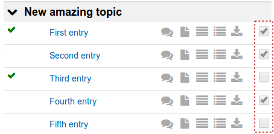
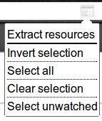
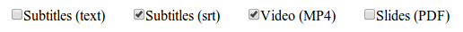

Coursera: Curly Downloader
==========================

This Chrome extension activates on Coursera lecture pages only.

In a click, it generates Curl configuration file which enables fast batch download of resources attached to the lectures.

## Lecture selection

The extension introduces a checkbox nearby every lecture row, to the right of associated resource icons.

`Shift`-key selection is also supported. If a checkbox is clicked holding `Shift`, entire range between the last two checkboxes is inverted (not including former one).

Extension popup menu also provides some ways to control the selection.

## Filtering

Extracted links can be easily filtered by type.

Some &ldquo;useless&rdquo; links (e.g. ones leading to forum topics) are cut off instantly.

## Using with Curl

Configuration file is generated in a new tab ready to be copied. It includes required authentication cookie and can be launched by Curl using the `--config` option.

    # Assume configuration is saved to the file named "config.curl"
    curl --config config.curl

This will start the download.
